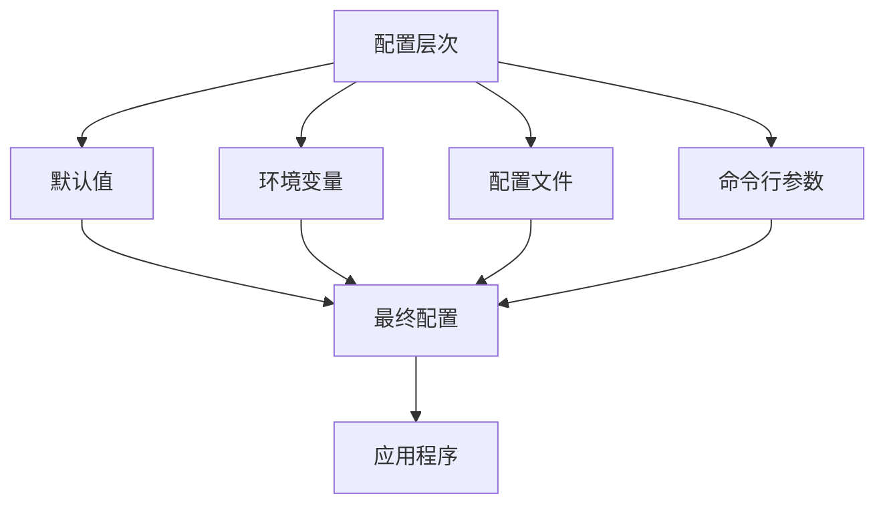

# ZoteroFlow2 配置说明

## 概述

ZoteroFlow2 支持多种配置方式，包括环境变量、配置文件、命令行参数等。本文档详细说明了所有可配置项、配置方法和最佳实践。

## 配置层次结构



配置优先级（从高到低）：
1. 命令行参数
2. 环境变量
3. 配置文件
4. 默认值

## 环境变量配置

### 必需配置项

#### Zotero 数据库配置

```bash
# Zotero SQLite 数据库文件路径
export ZOTERO_DB_PATH=~/Zotero/zotero.sqlite

# Zotero 存储目录路径
export ZOTERO_DATA_DIR=~/Zotero/storage
```

**说明**:
- `ZOTERO_DB_PATH`: Zotero 主数据库文件的完整路径
- `ZOTERO_DATA_DIR`: Zotero 附件存储目录的完整路径

**常见路径**:
- Linux: `~/Zotero/zotero.sqlite`, `~/Zotero/storage`
- macOS: `~/Library/Application Support/Zotero/Zotero/Zotero.sqlite`
- Windows: `%APPDATA%\Zotero\Zotero\Zotero.sqlite`

#### MinerU API 配置

```bash
# MinerU API 服务地址
export MINERU_API_URL=https://mineru.net/api/v4

# MinerU API 认证令牌
export MINERU_TOKEN=your_mineru_token_here
```

**说明**:
- `MINERU_API_URL`: MinerU API 服务的基础URL
- `MINERU_TOKEN`: 用于 MinerU API 认证的令牌

**获取 Token**:
1. 访问 [MinerU 官网](https://mineru.net/)
2. 注册并登录账号
3. 在控制台中生成 API Token
4. 将 Token 配置到环境变量中

#### AI 服务配置

```bash
# AI API 密钥
export AI_API_KEY=your_ai_api_key_here

# AI API 基础URL
export AI_BASE_URL=https://open.bigmodel.cn/api/coding/paas/v4

# AI 模型名称
export AI_MODEL=glm-4.6

# AI 请求超时时间（秒）
export AI_TIMEOUT=20
```

**说明**:
- `AI_API_KEY`: 智谱 AI API 的密钥
- `AI_BASE_URL`: AI API 服务的基础URL
- `AI_MODEL`: 使用的 AI 模型名称
- `AI_TIMEOUT`: AI 请求的超时时间（秒）

**支持的模型**:
- `glm-4.6`: 智谱 GLM-4.6 模型
- `glm-4-flash`: 智谱 GLM-4-flash 模型
- `glm-3-turbo`: 智谱 GLM-3-turbo 模型

### 可选配置项

#### 缓存配置

```bash
# 缓存目录路径
export CACHE_DIR=~/.zoteroflow/cache

# 解析结果目录
export RESULTS_DIR=data/results

# 解析记录目录
export RECORDS_DIR=data/records
```

#### 性能配置

```bash
# MinerU 解析超时时间（秒）
export MINERU_TIMEOUT=60

# 最大并发解析数量
export MAX_CONCURRENT_PARSING=3

# 缓存条目最大数量
export MAX_CACHE_SIZE=1000

# 缓存TTL时间（秒）
export CACHE_TTL=3600
```

#### 日志配置

```bash
# 日志级别
export LOG_LEVEL=info

# 日志文件路径
export LOG_FILE=~/.zoteroflow/logs/app.log

# 日志文件最大大小（MB）
export LOG_MAX_SIZE=100

# 日志文件保留数量
export LOG_MAX_FILES=5
```

#### MCP 配置

```bash
# Article MCP 命令
export MCP_ARTICLE_COMMAND="uv tool run article-mcp server"

# MCP 连接超时时间（秒）
export MCP_CONNECTION_TIMEOUT=10

# MCP 请求超时时间（秒）
export MCP_REQUEST_TIMEOUT=60
```

## 配置文件

### .env 文件

在项目根目录创建 `.env` 文件：

```bash
# Zotero 配置
ZOTERO_DB_PATH=~/Zotero/zotero.sqlite
ZOTERO_DATA_DIR=~/Zotero/storage

# MinerU 配置
MINERU_API_URL=https://mineru.net/api/v4
MINERU_TOKEN=your_mineru_token_here

# AI 配置
AI_API_KEY=your_ai_api_key_here
AI_BASE_URL=https://open.bigmodel.cn/api/coding/paas/v4
AI_MODEL=glm-4.6
AI_TIMEOUT=20

# 缓存配置
CACHE_DIR=~/.zoteroflow/cache
RESULTS_DIR=data/results
RECORDS_DIR=data/records

# 性能配置
MINERU_TIMEOUT=60
MAX_CONCURRENT_PARSING=3
MAX_CACHE_SIZE=1000
CACHE_TTL=3600

# 日志配置
LOG_LEVEL=info
LOG_FILE=~/.zoteroflow/logs/app.log
LOG_MAX_SIZE=100
LOG_MAX_FILES=5

# MCP 配置
MCP_ARTICLE_COMMAND="uv tool run article-mcp server"
MCP_CONNECTION_TIMEOUT=10
MCP_REQUEST_TIMEOUT=60
```

### TOML 配置文件

创建 `config/zoteroflow.toml` 文件：

```toml
[zotero]
db_path = "~/Zotero/zotero.sqlite"
data_dir = "~/Zotero/storage"

[mineru]
api_url = "https://mineru.net/api/v4"
token = "your_mineru_token_here"
timeout = 60

[ai]
api_key = "your_ai_api_key_here"
base_url = "https://open.bigmodel.cn/api/coding/paas/v4"
model = "glm-4.6"
timeout = 20

[cache]
dir = "~/.zoteroflow/cache"
results_dir = "data/results"
records_dir = "data/records"
max_size = 1000
ttl = 3600

[performance]
max_concurrent_parsing = 3
mineru_timeout = 60

[logging]
level = "info"
file = "~/.zoteroflow/logs/app.log"
max_size = 100
max_files = 5

[mcp]
article_command = "uv tool run article-mcp server"
connection_timeout = 10
request_timeout = 60
```

### YAML 配置文件

创建 `config/zoteroflow.yaml` 文件：

```yaml
zotero:
  db_path: "~/Zotero/zotero.sqlite"
  data_dir: "~/Zotero/storage"

mineru:
  api_url: "https://mineru.net/api/v4"
  token: "your_mineru_token_here"
  timeout: 60

ai:
  api_key: "your_ai_api_key_here"
  base_url: "https://open.bigmodel.cn/api/coding/paas/v4"
  model: "glm-4.6"
  timeout: 20

cache:
  dir: "~/.zoteroflow/cache"
  results_dir: "data/results"
  records_dir: "data/records"
  max_size: 1000
  ttl: 3600

performance:
  max_concurrent_parsing: 3
  mineru_timeout: 60

logging:
  level: "info"
  file: "~/.zoteroflow/logs/app.log"
  max_size: 100
  max_files: 5

mcp:
  article_command: "uv tool run article-mcp server"
  connection_timeout: 10
  request_timeout: 60
```

## 命令行参数

### CLI 参数

```bash
# 指定配置文件
./bin/zoteroflow2 --config=/path/to/config.toml

# 指定日志级别
./bin/zoteroflow2 --log-level=debug

# 指定缓存目录
./bin/zoteroflow2 --cache-dir=/tmp/cache

# 指定数据库路径
./bin/zoteroflow2 --zotero-db=/path/to/zotero.sqlite

# 指定数据目录
./bin/zoteroflow2 --zotero-data=/path/to/storage

# 指定 MinerU Token
./bin/zoteroflow2 --mineru-token=your_token

# 指定 AI API Key
./bin/zoteroflow2 --ai-api-key=your_api_key

# 启用调试模式
./bin/zoteroflow2 --debug

# 显示版本信息
./bin/zoteroflow2 --version

# 显示帮助信息
./bin/zoteroflow2 --help
```

### 参数说明

| 参数 | 简写 | 说明 | 默认值 |
|------|------|------|--------|
| `--config` | `-c` | 配置文件路径 | - |
| `--log-level` | `-l` | 日志级别 (debug/info/warn/error) | info |
| `--cache-dir` | - | 缓存目录路径 | ~/.zoteroflow/cache |
| `--results-dir` | - | 结果目录路径 | data/results |
| `--zotero-db` | - | Zotero数据库路径 | ~/Zotero/zotero.sqlite |
| `--zotero-data` | - | Zotero数据目录路径 | ~/Zotero/storage |
| `--mineru-token` | - | MinerU API Token | - |
| `--ai-api-key` | - | AI API Key | - |
| `--ai-model` | - | AI模型名称 | glm-4.6 |
| `--debug` | `-d` | 启用调试模式 | false |
| `--version` | `-v` | 显示版本信息 | - |
| `--help` | `-h` | 显示帮助信息 | - |

## 配置验证

### 1. 配置检查命令

```bash
# 检查配置文件
./bin/zoteroflow2 --check-config

# 验证数据库连接
./bin/zoteroflow2 --check-db

# 验证 MinerU 连接
./bin/zoteroflow2 --check-mineru

# 验证 AI 连接
./bin/zoteroflow2 --check-ai

# 验证 MCP 连接
./bin/zoteroflow2 --check-mcp
```

### 2. 配置诊断

```bash
# 显示当前配置
./bin/zoteroflow2 --show-config

# 诊断配置问题
./bin/zoteroflow2 --diagnose

# 生成配置报告
./bin/zoteroflow2 --config-report > config-report.txt
```

## 环境特定配置

### 开发环境

```bash
# 开发环境配置
export LOG_LEVEL=debug
export CACHE_TTL=300
export MAX_CONCURRENT_PARSING=1

# 使用开发配置文件
export CONFIG_FILE=config/dev.toml
```

### 测试环境

```bash
# 测试环境配置
export LOG_LEVEL=info
export CACHE_TTL=600
export MAX_CONCURRENT_PARSING=2

# 使用测试配置文件
export CONFIG_FILE=config/test.toml
```

### 生产环境

```bash
# 生产环境配置
export LOG_LEVEL=warn
export CACHE_TTL=3600
export MAX_CONCURRENT_PARSING=5

# 使用生产配置文件
export CONFIG_FILE=config/prod.toml
```

## 配置模板

### 开发环境模板

创建 `config/dev.toml`：

```toml
[zotero]
db_path = "~/Zotero/zotero.sqlite"
data_dir = "~/Zotero/storage"

[mineru]
api_url = "https://mineru.net/api/v4"
token = "dev_token_here"
timeout = 30

[ai]
api_key = "dev_api_key_here"
base_url = "https://open.bigmodel.cn/api/coding/paas/v4"
model = "glm-4.6"
timeout = 30

[cache]
dir = "~/.zoteroflow/cache-dev"
results_dir = "data/results-dev"
records_dir = "data/records-dev"
max_size = 100
ttl = 300

[performance]
max_concurrent_parsing = 1
mineru_timeout = 30

[logging]
level = "debug"
file = "~/.zoteroflow/logs/dev.log"
max_size = 50
max_files = 3
```

### 测试环境模板

创建 `config/test.toml`：

```toml
[zotero]
db_path = "~/Zotero/zotero.sqlite"
data_dir = "~/Zotero/storage"

[mineru]
api_url = "https://mineru.net/api/v4"
token = "test_token_here"
timeout = 45

[ai]
api_key = "test_api_key_here"
base_url = "https://open.bigmodel.cn/api/coding/paas/v4"
model = "glm-4.6"
timeout = 25

[cache]
dir = "~/.zoteroflow/cache-test"
results_dir = "data/results-test"
records_dir = "data/records-test"
max_size = 500
ttl = 600

[performance]
max_concurrent_parsing = 2
mineru_timeout = 45

[logging]
level = "info"
file = "~/.zoteroflow/logs/test.log"
max_size = 75
max_files = 4
```

### 生产环境模板

创建 `config/prod.toml`：

```toml
[zotero]
db_path = "/opt/zoteroflow/data/zotero.sqlite"
data_dir = "/opt/zoteroflow/data/storage"

[mineru]
api_url = "https://mineru.net/api/v4"
token = "prod_token_here"
timeout = 90

[ai]
api_key = "prod_api_key_here"
base_url = "https://open.bigmodel.cn/api/coding/paas/v4"
model = "glm-4.6"
timeout = 15

[cache]
dir = "/opt/zoteroflow/cache"
results_dir = "/opt/zoteroflow/data/results"
records_dir = "/opt/zoteroflow/data/records"
max_size = 2000
ttl = 7200

[performance]
max_concurrent_parsing = 5
mineru_timeout = 90

[logging]
level = "warn"
file = "/var/log/zoteroflow/app.log"
max_size = 200
max_files = 10
```

## 配置最佳实践

### 1. 安全配置

```bash
# 使用环境变量存储敏感信息
export MINERU_TOKEN=your_token
export AI_API_KEY=your_api_key

# 设置适当的文件权限
chmod 600 .env
chmod 700 ~/.zoteroflow
```

### 2. 性能优化

```bash
# 根据硬件配置调整并发参数
export MAX_CONCURRENT_PARSING=4  # 4核CPU
export CACHE_TTL=7200             # 2小时缓存

# 使用SSD存储
export CACHE_DIR=/ssd/zoteroflow/cache
```

### 3. 监控配置

```bash
# 启用详细日志
export LOG_LEVEL=info
export LOG_FILE=/var/log/zoteroflow/app.log

# 配置日志轮转
export LOG_MAX_SIZE=100
export LOG_MAX_FILES=7
```

### 4. 容器化配置

```dockerfile
# Dockerfile 中的配置
ENV ZOTERO_DB_PATH=/app/data/zotero.sqlite
ENV ZOTERO_DATA_DIR=/app/data/storage
ENV CACHE_DIR=/app/cache
ENV RESULTS_DIR=/app/results
```

## 配置迁移

### 从旧版本迁移

```bash
# 备份现有配置
cp .env .env.backup

# 迁移到新配置格式
./bin/zoteroflow2 --migrate-config

# 验证新配置
./bin/zoteroflow2 --check-config
```

### 配置版本管理

```bash
# 版本化配置文件
git add .env config/
git commit -m "Update configuration v1.2.0"

# 标记配置版本
git tag -a config-v1.2.0 -m "Configuration version 1.2.0"
```

## 配置验证脚本

### 自动验证脚本

创建 `scripts/validate-config.sh`：

```bash
#!/bin/bash

echo "=== ZoteroFlow2 配置验证 ==="

# 检查必需的环境变量
required_vars=(
    "ZOTERO_DB_PATH"
    "ZOTERO_DATA_DIR"
    "MINERU_TOKEN"
    "AI_API_KEY"
)

missing_vars=()
for var in "${required_vars[@]}"; do
    if [[ -z "${!var}" ]]; then
        missing_vars+=("$var")
    fi
done

if [[ ${#missing_vars[@]} -gt 0 ]]; then
    echo "❌ 缺少必需的环境变量:"
    printf '  %s\n' "${missing_vars[@]}"
    exit 1
fi

# 检查文件路径
paths=(
    "$ZOTERO_DB_PATH"
    "$ZOTERO_DATA_DIR"
    "$CACHE_DIR"
)

missing_paths=()
for path in "${paths[@]}"; do
    if [[ ! -e "$path" ]]; then
        missing_paths+=("$path")
    fi
done

if [[ ${#missing_paths[@]} -gt 0 ]]; then
    echo "❌ 缺少必需的路径:"
    printf '  %s\n' "${missing_paths[@]}"
    echo "请创建这些路径或检查配置"
fi

# 检查API连接
echo "检查 MinerU API 连接..."
if curl -s -H "Authorization: Bearer $MINERU_TOKEN" \
       "$MINERU_API_URL/file-urls/batch" > /dev/null; then
    echo "✅ MinerU API 连接正常"
else
    echo "❌ MinerU API 连接失败"
fi

echo "检查 AI API 连接..."
if curl -s -H "Authorization: Bearer $AI_API_KEY" \
       -H "Content-Type: application/json" \
       -d '{"model":"glm-4.6","messages":[{"role":"user","content":"test"}]}' \
       "$AI_BASE_URL/chat/completions" > /dev/null; then
    echo "✅ AI API 连接正常"
else
    echo "❌ AI API 连接失败"
fi

echo "=== 配置验证完成 ==="
```

### 配置测试脚本

创建 `scripts/test-config.sh`：

```bash
#!/bin/bash

echo "=== ZoteroFlow2 配置测试 ==="

# 测试数据库连接
echo "测试数据库连接..."
if ./bin/zoteroflow2 --check-db; then
    echo "✅ 数据库连接测试通过"
else
    echo "❌ 数据库连接测试失败"
fi

# 测试MinerU连接
echo "测试MinerU连接..."
if ./bin/zoteroflow2 --check-mineru; then
    echo "✅ MinerU连接测试通过"
else
    echo "❌ MinerU连接测试失败"
fi

# 测试AI连接
echo "测试AI连接..."
if ./bin/zoteroflow2 --check-ai; then
    echo "✅ AI连接测试通过"
else
    echo "❌ AI连接测试失败"
fi

# 测试MCP连接
echo "测试MCP连接..."
if ./bin/zoteroflow2 --check-mcp; then
    echo "✅ MCP连接测试通过"
else
    echo "❌ MCP连接测试失败"
fi

echo "=== 配置测试完成 ==="
```

## 故障排除

### 配置相关错误

#### 1. 数据库连接错误

**错误**: `连接数据库失败: database is locked`

**解决方案**:
```bash
# 检查Zotero是否正在运行
ps aux | grep zotero

# 关闭Zotero或使用只读模式
export ZOTERO_DB_PATH="file:$HOME/Zotero/zotero.sqlite?mode=ro"
```

#### 2. API认证错误

**错误**: `MinerU解析失败: authentication failed`

**解决方案**:
```bash
# 验证Token
curl -H "Authorization: Bearer $MINERU_TOKEN" \
     $MINERU_API_URL/file-urls/batch

# 重新获取Token
# 更新环境变量
export MINERU_TOKEN=new_token
```

#### 3. 路径配置错误

**错误**: `PDF文件不存在: /path/to/file.pdf`

**解决方案**:
```bash
# 检查路径配置
echo $ZOTERO_DATA_DIR
echo $ZOTERO_DB_PATH

# 验证文件存在
ls -la "$ZOTERO_DATA_DIR"

# 使用绝对路径
export ZOTERO_DATA_DIR="/full/path/to/storage"
```

### 配置调试

#### 启用调试模式

```bash
# 启用详细日志
export LOG_LEVEL=debug
./bin/zoteroflow2 --debug

# 查看配置信息
./bin/zoteroflow2 --show-config
```

#### 配置诊断

```bash
# 运行诊断
./bin/zoteroflow2 --diagnose

# 生成配置报告
./bin/zoteroflow2 --config-report
```

这个配置说明文档涵盖了 ZoteroFlow2 的所有配置选项，包括环境变量、配置文件、命令行参数等，并提供了配置验证、最佳实践和故障排除指南。通过合理配置，您可以充分发挥 ZoteroFlow2 的功能。