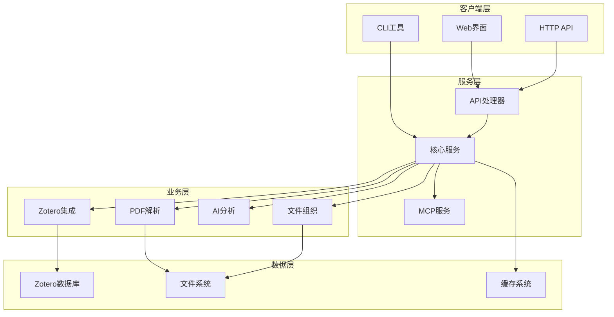

# ZoteroFlow2 开发者指南

## 概述

本文档为 ZoteroFlow2 的开发者提供全面的开发指南，包括架构设计、开发环境搭建、代码规范、测试指南、贡献流程等内容。

## 目录结构

```
zoteroflow2/
├── server/                 # 服务器端代码
│   ├── main.go            # 主程序入口
│   ├── config/            # 配置管理
│   ├── core/              # 核心业务逻辑
│   │   ├── zotero.go      # Zotero数据库集成
│   │   ├── mineru.go      # MinerU PDF解析
│   │   ├── parser.go      # 文档解析器
│   │   ├── organizer.go   # 文件组织器
│   │   └── ai.go          # AI对话管理
│   ├── mcp/               # MCP协议实现
│   └── api/               # HTTP API接口
├── tests/                  # 测试代码
│   ├── unit/              # 单元测试
│   ├── integration/       # 集成测试
│   └── e2e/               # 端到端测试
├── docs/                   # 文档
│   ├── api/               # API文档
│   ├── developer/         # 开发者文档
│   └── deployment/        # 部署文档
├── scripts/                # 脚本工具
├── Makefile               # 构建配置
└── README.md              # 项目说明
```

## 开发环境搭建

### 1. 系统要求

- **操作系统**: Linux (Ubuntu 20.04+), macOS 10.15+, Windows 10+
- **Go 版本**: 1.21 或更高版本
- **Python 版本**: 3.8+ (用于 Article MCP)
- **Git**: 版本控制工具

### 2. 依赖安装

#### Go 环境

```bash
# 安装 Go 1.21+
# Linux
sudo apt update
sudo apt install golang-go

# macOS
brew install go

# Windows
# 下载并安装 Go 安装包

# 验证安装
go version
```

#### Python 和 uv

```bash
# 安装 Python 3.8+
# Linux
sudo apt install python3 python3-pip

# macOS
brew install python@3.8

# 安装 uv
curl -LsSf https://astral.sh/uv/install.sh | sh

# 验证安装
python3 --version
uv --version
```

#### 开发工具

```bash
# 安装开发工具
go install github.com/golangci/golangci-lint/cmd/golangci-lint@latest
go install github.com/air-verse/air@latest
go install github.com/swaggo/swag/cmd/swag@latest
```

### 3. 项目设置

```bash
# 克隆项目
git clone https://github.com/your-org/zoteroflow2.git
cd zoteroflow2

# 进入服务器目录
cd server/

# 安装依赖
make deps

# 构建项目
make build

# 运行测试
make test

# 启动开发服务器
make dev
```

### 4. IDE 配置

#### VS Code

推荐安装以下扩展：

```json
{
  "recommendations": [
    "golang.go",
    "ms-vscode.makefile-tools",
    "redhat.vscode-yaml",
    "ms-vscode.openapi",
    "bradlc.vscode-tailwindcss"
  ]
}
```

配置文件 `.vscode/settings.json`：

```json
{
  "go.toolsManagement.autoUpdate": true,
  "go.useLanguageServer": true,
  "go.lintTool": "golangci-lint",
  "go.lintFlags": [
    "--fast"
  ],
  "go.formatTool": "goimports",
  "go.testFlags": ["-v", "-race"],
  "go.coverOnSave": true,
  "go.coverageDecorator": {
    "type": "gutter",
    "coveredHighlightColor": "rgba(64,128,64,0.5)",
    "uncoveredHighlightColor": "rgba(128,64,64,0.25)"
  }
}
```

#### GoLand

配置 GoLand：
1. 设置 Go SDK 路径
2. 启用 Go Modules 支持
3. 配置代码格式化（gofmt, goimports）
4. 启用代码检查（golangci-lint）
5. 配置测试运行器

## 架构设计

### 1. 整体架构



### 2. 核心模块

#### Zotero 集成模块

负责与 Zotero 数据库的交互，提供文献查询、元数据提取等功能。

**主要功能**：
- 数据库连接管理
- 文献查询和搜索
- PDF 文件路径解析
- 元数据提取和格式化

**关键接口**：
```go
type ZoteroDB interface {
    GetItemsWithPDF(limit int) ([]ZoteroItem, error)
    SearchByTitle(query string, limit int) ([]SearchResult, error)
    GetStats() (map[string]interface{}, error)
    Close() error
}
```

#### MinerU 集成模块

负责与 MinerU API 的交互，提供 PDF 解析功能。

**主要功能**：
- API 客户端管理
- 批量任务提交
- 文件上传和下载
- 状态轮询和监控
- 解析记录管理

**关键接口**：
```go
type MinerUClient interface {
    ParsePDF(ctx context.Context, pdfPath string) (*ParseResult, error)
    GetParseRecords(date string) ([]ParseRecord, error)
}
```

#### AI 对话模块

负责与 AI 服务的交互，提供智能对话功能。

**主要功能**：
- AI 客户端管理
- 对话上下文管理
- 消息历史记录
- 文档上下文构建

**关键接口**：
```go
type AIConversationManager interface {
    StartConversation(ctx context.Context, message string, documentIDs []int) (*Conversation, error)
    ContinueConversation(ctx context.Context, convID, message string) (*Conversation, error)
    GetConversation(convID string) (*Conversation, error)
}
```

#### 文件组织模块

负责解析结果的后处理和文件组织。

**主要功能**：
- ZIP 文件解压
- 文件结构整理
- 元数据生成
- 索引链接创建

**关键接口**：
```go
func OrganizeResult(zipPath, pdfPath string) error
```

### 3. MCP 协议实现

MCP (Model Context Protocol) 协议实现，支持与外部工具的集成。

**主要功能**：
- JSON-RPC 2.0 通信
- 工具注册和发现
- 请求/响应处理
- 错误处理和重试

**关键接口**：
```go
type MCPClient interface {
    Start() error
    Stop() error
    Initialize(clientName, clientVersion string) (*InitializeResult, error)
    ListTools() (*ListToolsResult, error)
    CallTool(toolName string, arguments map[string]interface{}) (*CallToolResult, error)
}
```

## 代码规范

### 1. 命名规范

#### 包名

- 使用小写字母
- 简短、有意义
- 避免下划线（除非必要）

```go
// 好的包名
package core
package config
package mcp

// 不好的包名
package core_service
package CoreService
```

#### 变量名

- 使用驼峰命名法（CamelCase）
- 私有变量以小写字母开头
- 公开变量以大写字母开头

```go
// 好的变量名
var zoteroDB *ZoteroDB
var mineruClient *MinerUClient

const MaxRetryCount = 3

// 不好的变量名
var zotero_db *ZoteroDB
var mineru_client *MinerUClient
```

#### 函数名

- 使用驼峰命名法
- 私有函数以小写字母开头
- 公开函数以大写字母开头
- 动词或动词短语

```go
// 好的函数名
func NewZoteroDB(dbPath, dataDir string) (*ZoteroDB, error)
func (z *ZoteroDB) GetItemsWithPDF(limit int) ([]ZoteroItem, error)
func (z *ZoteroDB) searchByTitle(query string) ([]SearchResult, error)

// 不好的函数名
func new_zotero_db(dbPath, dataDir string) (*ZoteroDB, error)
func (z *ZoteroDB) get_items_with_pdf(limit int) ([]ZoteroItem, error)
```

#### 结构体名

- 使用驼峰命名法
- 大写字母开头
- 简洁、描述性强

```go
// 好的结构体名
type ZoteroDB struct {}
type MinerUClient struct {}
type PDFParser struct {}

// 不好的结构体名
type zoteroDb struct {}
type mineru_client struct {}
```

#### 接口名

- 使用驼峰命名法
- 大写字母开头
- 通常以 "er" 结尾

```go
// 好的接口名
type ZoteroDBer interface {}
type Parser interface {}
type Organizer interface {}

// 不好的接口名
type zotero_db_interface interface {}
type parser_interface interface {}
```

### 2. 代码格式化

#### 使用 gofmt

```bash
# 格式化所有代码
go fmt ./...

# 或者使用 make 命令
make fmt
```

#### 使用 goimports

```bash
# 整理导入
goimports -w .

# 或者使用 make 命令
make fmt
```

#### 配置编辑器

VS Code `.vscode/settings.json`：
```json
{
  "go.formatTool": "goimports",
  "go.lintTool": "golangci-lint",
  "go.lintFlags": ["--fast"]
}
```

### 3. 注释规范

#### 包注释

```go
// Package core provides core functionality for ZoteroFlow2,
// including Zotero database integration, PDF parsing, and AI analysis.
package core
```

#### 公开函数注释

```go
// NewZoteroDB creates a new ZoteroDB instance with the specified database
// path and data directory. It establishes a read-only connection to the
// SQLite database and validates the connection.
//
// Parameters:
//   - dbPath: Path to the Zotero SQLite database file
//   - dataDir: Path to the Zotero storage directory
//
// Returns:
//   - *ZoteroDB: ZoteroDB instance
//   - error: Error if connection fails
//
// Example:
//   db, err := NewZoteroDB("~/Zotero/zotero.sqlite", "~/Zotero/storage")
//   if err != nil {
//       log.Fatal(err)
//   }
//   defer db.Close()
func NewZoteroDB(dbPath, dataDir string) (*ZoteroDB, error) {
    // implementation
}
```

#### 结构体注释

```go
// ZoteroDB represents a connection to a Zotero SQLite database.
// It provides read-only access to the database for literature
// metadata and file information.
type ZoteroDB struct {
    db      *sql.DB  // Database connection
    dataDir string    // Data directory path
    dbPath  string    // Database file path
}
```

#### 复杂逻辑注释

```go
// parseAttachmentsPath parses the attachments path from Zotero database
// format and extracts the actual file path. The attachments path
// format is typically "attachments:filename" where the filename
// contains the actual file information.
//
// The parsing logic follows these steps:
// 1. Split the path by ":" to get the type and filename
// 2. For "attachments:" type, parse the filename format
// 3. Extract the actual filename from the attachment metadata
// 4. Construct the full path using the data directory
//
// This function handles both old and new Zotero attachment formats.
func (z *ZoteroDB) parseAttachmentsPath(pathPart string) string {
    // implementation
}
```

### 4. 错误处理

#### 错误定义

```go
// 定义自定义错误类型
type AppError struct {
    Code    string `json:"code"`
    Message string `json:"message"`
    Details string `json:"details,omitempty"`
}

func (e *AppError) Error() string {
    return e.Message
}

// 预定义错误
var (
    ErrDatabaseNotFound = &AppError{
        Code:    "DATABASE_NOT_FOUND",
        Message: "Database file not found",
    }
    
    ErrInvalidParameter = &AppError{
        Code:    "INVALID_PARAMETER",
        Message: "Invalid parameter provided",
    }
)
```

#### 错误处理模式

```go
// 函数错误处理
func (z *ZoteroDB) GetItemsWithPDF(limit int) ([]ZoteroItem, error) {
    // 参数验证
    if limit <= 0 {
        return nil, &AppError{
            Code:    "INVALID_PARAMETER",
            Message: "Limit must be positive",
        }
    }
    
    // 执行查询
    query := `SELECT ... FROM items WHERE ... LIMIT ?`
    rows, err := z.db.Query(query, limit)
    if err != nil {
        return nil, fmt.Errorf("database query failed: %w", err)
    }
    defer rows.Close()
    
    // 处理结果
    var items []ZoteroItem
    for rows.Next() {
        var item ZoteroItem
        if err := scanItem(&item, rows); err != nil {
            return nil, fmt.Errorf("failed to scan item: %w", err)
        }
        items = append(items, item)
    }
    
    return items, nil
}
```

#### 错误包装

```go
// 包装底层错误
func (z *ZoteroDB) connect() error {
    db, err := sql.Open("sqlite", z.dbPath)
    if err != nil {
        return fmt.Errorf("failed to open database: %w", err)
    }
    
    // 设置连接参数
    db.SetMaxOpenConns(1)
    db.SetMaxIdleConns(1)
    
    // 测试连接
    if err := db.Ping(); err != nil {
        return fmt.Errorf("database ping failed: %w", err)
    }
    
    z.db = db
    return nil
}
```

### 5. 并发安全

#### 互斥锁

```go
type SafeCounter struct {
    mu    sync.RWMutex
    count int
}

func (c *SafeCounter) Increment() {
    c.mu.Lock()
    defer c.mu.Unlock()
    c.count++
}

func (c *SafeCounter) Value() int {
    c.mu.RLock()
    defer c.mu.RUnlock()
    return c.count
}
```

#### 通道

```go
// 使用通道进行并发控制
func (p *PDFParser) BatchParseDocuments(ctx context.Context, itemIDs []int) ([]*ParsedDocument, error) {
    semaphore := make(chan struct{}, 3) // 限制并发数
    var wg sync.WaitGroup
    var mu sync.Mutex
    var results []*ParsedDocument
    var errors []error
    
    for _, itemID := range itemIDs {
        wg.Add(1)
        go func(id int) {
            defer wg.Done()
            
            semaphore <- struct{}{}
            defer func() { <-semaphore }()
            
            doc, err := p.ParseDocument(ctx, id, "")
            mu.Lock()
            if err != nil {
                errors = append(errors, fmt.Errorf("itemID %d: %w", id, err))
            } else {
                results = append(results, doc)
            }
            mu.Unlock()
        }(itemID)
    }
    
    wg.Wait()
    
    if len(errors) > 0 {
        return results, fmt.Errorf("batch parsing completed with %d errors", len(errors))
    }
    
    return results, nil
}
```

## 测试指南

### 1. 测试结构

```
tests/
├── unit/              # 单元测试
│   ├── zotero_test.go
│   ├── mineru_test.go
│   ├── parser_test.go
│   └── ai_test.go
├── integration/       # 集成测试
│   ├── api_test.go
│   ├── mcp_test.go
│   └── workflow_test.go
├── e2e/              # 端到端测试
│   ├── cli_test.go
│   └── full_workflow_test.go
└── fixtures/         # 测试数据
    ├── test_pdfs/
    ├── test_databases/
    └── mock_responses/
```

### 2. 单元测试

#### 测试框架

使用 Go 标准测试包 `testing` 和 testify 断言库。

```go
package core

import (
    "testing"
    "github.com/stretchr/testify/assert"
    "github.com/stretchr/testify/require"
)

func TestNewZoteroDB(t *testing.T) {
    // 准备测试数据库
    dbPath := createTestDatabase(t)
    defer os.Remove(dbPath)
    
    // 测试创建连接
    db, err := NewZoteroDB(dbPath, "/tmp/test_data")
    require.NoError(t, err)
    require.NotNil(t, db)
    
    // 测试连接
    assert.NoError(t, db.Ping())
    
    // 清理
    db.Close()
}

func TestZoteroDB_GetItemsWithPDF(t *testing.T) {
    // 准备测试数据库
    db := setupTestDatabase(t)
    defer db.Close()
    
    // 测试获取文献
    items, err := db.GetItemsWithPDF(5)
    require.NoError(t, err)
    assert.NotEmpty(t, items)
    
    // 验证结果
    for _, item := range items {
        assert.NotEmpty(t, item.Title)
        assert.NotEmpty(t, item.Authors)
    }
}
```

#### Mock 测试

使用 testify/mock 进行模拟测试。

```go
package core

import (
    "testing"
    "github.com/stretchr/testify/assert"
    "github.com/stretchr/testify/mock"
)

// MockMinerUClient 模拟 MinerU 客户端
type MockMinerUClient struct {
    mock.Mock
}

func (m *MockMinerUClient) ParsePDF(ctx context.Context, pdfPath string) (*ParseResult, error) {
    args := m.Called(ctx, pdfPath)
    return args.Get(0).(*ParseResult), args.Error(1)
}

func TestPDFParser_ParseDocument(t *testing.T) {
    // 创建模拟对象
    mockMinerU := new(MockMinerUClient)
    mockZotero := setupMockZoteroDB(t)
    
    // 创建解析器
    parser := &PDFParser{
        zoteroDB:     mockZotero,
        mineruClient: mockMinerU,
        cacheDir:     "/tmp/test_cache",
    }
    
    // 设置模拟期望
    expectedResult := &ParseResult{
        TaskID: "test-task-id",
        Status:  "completed",
    }
    mockMinerU.On("ParsePDF", mock.Anything, mock.Anything).Return(expectedResult, nil)
    
    // 执行测试
    ctx := context.Background()
    result, err := parser.ParseDocument(ctx, 12345, "/tmp/test.pdf")
    
    // 验证结果
    assert.NoError(t, err)
    assert.Equal(t, expectedResult, result)
    
    // 验证模拟调用
    mockMinerU.AssertExpectations(t)
}
```

### 3. 集成测试

#### 数据库集成测试

```go
package integration

import (
    "testing"
    "github.com/stretchr/testify/require"
    "zoteroflow2-server/core"
)

func TestZoteroIntegration(t *testing.T) {
    if testing.Short() {
        t.Skip("Skipping integration test in short mode")
    }
    
    // 使用真实的测试数据库
    dbPath := os.Getenv("TEST_ZOTERO_DB")
    if dbPath == "" {
        t.Skip("TEST_ZOTERO_DB environment variable not set")
    }
    
    // 创建连接
    db, err := core.NewZoteroDB(dbPath, "/tmp/test_data")
    require.NoError(t, err)
    defer db.Close()
    
    // 测试查询
    items, err := db.GetItemsWithPDF(10)
    require.NoError(t, err)
    t.Logf("Found %d items with PDF", len(items))
    
    // 测试搜索
    results, err := db.SearchByTitle("machine learning", 5)
    require.NoError(t, err)
    t.Logf("Found %d search results", len(results))
}
```

#### API 集成测试

```go
package integration

import (
    "bytes"
    "encoding/json"
    "net/http"
    "net/http/httptest"
    "testing"
    "github.com/stretchr/testify/assert"
)

func TestLiteratureAPI(t *testing.T) {
    // 创建测试服务器
    server := httptest.NewServer(http.HandlerFunc(func(w http.ResponseWriter, r *http.Request) {
        switch r.URL.Path {
        case "/api/v1/literature":
            handleLiteratureRequest(w, r)
        default:
            http.NotFound(w, r)
        }
    }))
    defer server.Close()
    
    // 创建客户端
    client := &http.Client{}
    
    // 测试获取文献列表
    resp, err := client.Get(server.URL + "/api/v1/literature?page=1&limit=10")
    require.NoError(t, err)
    defer resp.Body.Close()
    
    assert.Equal(t, http.StatusOK, resp.StatusCode)
    
    // 验证响应
    var result LiteratureListResponse
    err = json.NewDecoder(resp.Body).Decode(&result)
    require.NoError(t, err)
    
    assert.True(t, result.Success)
    assert.NotEmpty(t, result.Data.Items)
}
```

### 4. 端到端测试

#### CLI 测试

```go
package e2e

import (
    "os/exec"
    "strings"
    "testing"
    "github.com/stretchr/testify/assert"
)

func TestCLICommands(t *testing.T) {
    if testing.Short() {
        t.Skip("Skipping E2E test in short mode")
    }
    
    // 构建二进制
    buildBinary(t)
    
    // 测试帮助命令
    output := runCommand(t, "./bin/zoteroflow2", "--help")
    assert.Contains(t, output, "ZoteroFlow2")
    assert.Contains(t, output, "Commands:")
    
    // 测试列表命令
    output = runCommand(t, "./bin/zoteroflow2", "list")
    assert.Contains(t, output, "找到")
    
    // 测试搜索命令
    output = runCommand(t, "./bin/zoteroflow2", "search", "test")
    assert.Contains(t, output, "搜索")
}

func buildBinary(t *testing.T) {
    cmd := exec.Command("make", "build")
    output, err := cmd.CombinedOutput()
    require.NoError(t, err, string(output))
}

func runCommand(t *testing.T, name string, args ...string) string {
    cmd := exec.Command(name, args...)
    output, err := cmd.CombinedOutput()
    if err != nil {
        t.Fatalf("Command failed: %v, output: %s", err, string(output))
    }
    return strings.TrimSpace(string(output))
}
```

### 5. 测试配置

#### Makefile 测试目标

```makefile
.PHONY: test test-unit test-integration test-e2e test-coverage test-all

# 运行所有测试
test-all: test-unit test-integration test-e2e

# 单元测试
test-unit:
	go test -v -race ./...

# 集成测试
test-integration:
	go test -v -race ./tests/integration/...

# 端到端测试
test-e2e:
	go test -v ./tests/e2e/

# 覆盖率测试
test-coverage:
	go test -v -race -coverprofile=coverage.out ./...
	go tool cover -html=coverage.out -o=coverage.html
	@echo "Coverage: $$(go tool cover -func=coverage.out | grep total | awk '{print $$3}')"

# 快速测试
test-quick:
	go test -short ./...
```

#### 测试配置

`go.mod` 测试依赖：
```go
module zoteroflow2-server

go 1.21

require (
    github.com/stretchr/testify/assert v1.8.4
    github.com/stretchr/testify/mock v1.6.0
    github.com/stretchr/testify/suite v1.8.0
    github.com/golang/mock v1.6.0
)
```

## 贡献流程

### 1. 分支策略

#### 主分支

- `main`: 稳定分支，只接受来自 `develop` 的 PR
- `develop`: 开发分支，功能开发的目标分支

#### 功能分支

- 从 `develop` 创建功能分支
- 分支命名：`feature/功能名称`
- 完成后合并回 `develop`

#### 修复分支

- 从 `develop` 创建修复分支
- 分支命名：`fix/问题描述`
- 完成后合并回 `develop`

#### 发布分支

- 从 `develop` 创建发布分支
- 分支命名：`release/v1.0.0`
- 完成后合并回 `main` 和 `develop`

### 2. 提交流程

#### 创建 Pull Request

1. Fork 项目到个人仓库
2. 创建功能分支：`git checkout -b feature/new-feature develop`
3. 开发并提交代码
4. 推送到个人仓库：`git push origin feature/new-feature`
5. 创建 Pull Request 到 `develop` 分支

#### PR 要求

- 标题清晰描述变更内容
- 描述中说明变更原因和实现方式
- 包含相关的测试用例
- 通过所有 CI 检查
- 代码审查通过

#### 代码审查

审查要点：
- 代码质量和可读性
- 功能正确性和完整性
- 测试覆盖率和质量
- 性能影响评估
- 安全性考虑

### 3. 代码审查清单

#### 功能性

- [ ] 功能按需求实现
- [ ] 边界条件处理正确
- [ ] 错误处理完善
- [ ] 日志记录适当

#### 代码质量

- [ ] 代码格式符合规范
- [ ] 命名规范遵循
- [ ] 注释清晰完整
- [ ] 无重复代码
- [ ] 无硬编码值

#### 测试

- [ ] 单元测试覆盖新功能
- [ ] 集成测试验证交互
- [ ] 边界条件有测试
- [ ] 错误场景有测试
- [ ] 测试通过 CI

#### 性能

- [ ] 无明显性能回归
- [ ] 内存使用合理
- [ ] 数据库查询优化
- [ ] 并发安全

#### 安全

- [ ] 无安全漏洞
- [ ] 输入验证充分
- [ ] 敏感信息保护
- [ ] 权限控制正确

### 4. 发布流程

#### 版本号规范

使用语义化版本号：`MAJOR.MINOR.PATCH`

- `MAJOR`: 不兼容的 API 变更
- `MINOR`: 向后兼容的功能新增
- `PATCH`: 向后兼容的问题修复

#### 发布步骤

1. 更新版本号
2. 更新 CHANGELOG
3. 创建发布分支
4. 运行完整测试
5. 创建发布标签
6. 构建发布包
7. 部署到生产环境

## 性能优化

### 1. 数据库优化

#### 查询优化

```go
// 使用预编译语句
stmt, err := z.db.Prepare(`
    SELECT itemID, title, authors, year 
    FROM items 
    WHERE hasPDF = 1 
    ORDER BY year DESC 
    LIMIT ?
`)
if err != nil {
    return nil, err
}
defer stmt.Close()

rows, err := stmt.Query(limit)
if err != nil {
    return nil, err
}
defer rows.Close()
```

#### 连接池配置

```go
// 设置连接池参数
db.SetMaxOpenConns(1)        // 只读访问，一个连接足够
db.SetMaxIdleConns(1)        // 最大空闲连接数
db.SetConnMaxLifetime(time.Hour) // 连接最大生存时间
```

### 2. 缓存策略

#### 内存缓存

```go
type Cache struct {
    mu    sync.RWMutex
    items map[string]interface{}
    ttl   time.Duration
}

func (c *Cache) Get(key string) (interface{}, bool) {
    c.mu.RLock()
    defer c.mu.RUnlock()
    
    if item, exists := c.items[key]; exists {
        return item, true
    }
    return nil, false
}

func (c *Cache) Set(key string, item interface{}) {
    c.mu.Lock()
    defer c.mu.Unlock()
    
    c.items[key] = item
    
    // 设置过期清理
    time.AfterFunc(c.ttl, func() {
        c.mu.Lock()
        delete(c.items, key)
        c.mu.Unlock()
    })
}
```

#### 文件缓存

```go
// 使用文件缓存存储解析结果
func (p *PDFParser) loadFromCache(cachePath string) (*ParsedDocument, error) {
    data, err := os.ReadFile(cachePath)
    if err != nil {
        return nil, err
    }
    
    var doc ParsedDocument
    if err := json.Unmarshal(data, &doc); err != nil {
        return nil, err
    }
    
    // 检查文件是否存在
    if _, err := os.Stat(doc.ZipPath); os.IsNotExist(err) {
        return nil, fmt.Errorf("ZIP file not exists: %s", doc.ZipPath)
    }
    
    return &doc, nil
}
```

### 3. 并发优化

#### 工作池模式

```go
type WorkerPool struct {
    tasks    chan Task
    workers  int
    wg       sync.WaitGroup
    quit     chan struct{}
}

func NewWorkerPool(workers int) *WorkerPool {
    pool := &WorkerPool{
        tasks:   make(chan Task, workers*2),
        workers: workers,
        quit:    make(chan struct{}),
    }
    
    pool.wg.Add(workers)
    for i := 0; i < workers; i++ {
        go pool.worker()
    }
    
    return pool
}

func (p *WorkerPool) worker() {
    defer p.wg.Done()
    
    for {
        select {
        case task := <-p.tasks:
            task.Execute()
        case <-p.quit:
            return
        }
    }
}

func (p *WorkerPool) Submit(task Task) {
    select {
    case p.tasks <- task:
    case <-p.quit:
        return
    }
}

func (p *WorkerPool) Stop() {
    close(p.quit)
    p.wg.Wait()
}
```

#### 批量处理

```go
func (p *PDFParser) BatchParseDocuments(ctx context.Context, itemIDs []int) ([]*ParsedDocument, error) {
    semaphore := make(chan struct{}, 3) // 限制并发数
    var wg sync.WaitGroup
    var mu sync.Mutex
    var results []*ParsedDocument
    var errors []error
    
    for _, itemID := range itemIDs {
        wg.Add(1)
        go func(id int) {
            defer wg.Done()
            
            semaphore <- struct{}{}
            defer func() { <-semaphore }()
            
            doc, err := p.ParseDocument(ctx, id, "")
            mu.Lock()
            if err != nil {
                errors = append(errors, fmt.Errorf("itemID %d: %w", id, err))
            } else {
                results = append(results, doc)
            }
            mu.Unlock()
        }(itemID)
    }
    
    wg.Wait()
    
    if len(errors) > 0 {
        return results, fmt.Errorf("batch parsing completed with %d errors", len(errors))
    }
    
    return results, nil
}
```

## 部署指南

### 1. 构建配置

#### Makefile

```makefile
.PHONY: build build-prod build-dev clean run dev

# 开发构建
build-dev:
	go build -o bin/zoteroflow2-dev .

# 生产构建
build-prod:
	CGO_ENABLED=1 go build -ldflags="-w -s" -o bin/zoteroflow2-prod .

# 清理构建文件
clean:
	rm -rf bin/

# 运行开发服务器
dev:
	./bin/zoteroflow2-dev

# 运行生产服务器
run:
	./bin/zoteroflow2-prod
```

#### Docker 构建

```dockerfile
# 多阶段构建
FROM golang:1.21-alpine AS builder

WORKDIR /app
COPY go.mod go.sum ./
RUN go mod download

COPY . .
RUN CGO_ENABLED=1 go build -ldflags="-w -s" -o bin/zoteroflow2 .

FROM alpine:latest
RUN apk --no-cache add ca-certificates tzdata
RUN addgroup -g 1000 zoteroflow && \
    adduser -D -s /bin/sh -u 1000 zoteroflow

WORKDIR /app
COPY --from=builder /app/bin/zoteroflow2 .
COPY --from=builder /app/.env.production .env

USER zoteroflow
EXPOSE 8080
CMD ["./zoteroflow2"]
```

### 2. 容器化部署

#### Docker Compose

```yaml
version: '3.8'

services:
  zoteroflow2:
    build:
      context: .
      dockerfile: Dockerfile
    ports:
      - "8080:8080"
    volumes:
      - ./data:/app/data
      - /home/user/.zoteroflow:/app/.zoteroflow
    environment:
      - ZOTERO_DB_PATH=/app/data/zotero.sqlite
      - ZOTERO_DATA_DIR=/app/data/storage
    restart: unless-stopped
    healthcheck:
      test: ["CMD", "./zoteroflow2", "--check-health"]
      interval: 30s
      timeout: 10s
      retries: 3
```

#### Kubernetes 部署

```yaml
apiVersion: apps/v1
kind: Deployment
metadata:
  name: zoteroflow2
spec:
  replicas: 3
  selector:
    matchLabels:
      app: zoteroflow2
  template:
    metadata:
      labels:
        app: zoteroflow2
    spec:
      containers:
      - name: zoteroflow2
        image: zoteroflow2:latest
        ports:
        - containerPort: 8080
        env:
        - name: ZOTERO_DB_PATH
          value: "/app/data/zotero.sqlite"
        - name: ZOTERO_DATA_DIR
          value: "/app/data/storage"
        volumeMounts:
        - name: data-volume
          mountPath: /app/data
        livenessProbe:
          httpGet:
            path: /health
            port: 8080
          initialDelaySeconds: 30
          periodSeconds: 10
        readinessProbe:
          httpGet:
            path: /ready
            port: 8080
          initialDelaySeconds: 5
          periodSeconds: 5
      volumes:
      - name: data-volume
        persistentVolumeClaim:
          claimName: zoteroflow2-data
```

### 3. 监控配置

#### 健康检查

```go
func (s *Server) healthHandler(w http.ResponseWriter, r *http.Request) {
    health := HealthResponse{
        Status:    "healthy",
        Version:   s.version,
        Uptime:    time.Since(s.startTime).Seconds(),
        Services:  s.checkServices(),
    }
    
    if !health.IsHealthy() {
        w.WriteHeader(http.StatusServiceUnavailable)
    }
    
    w.Header().Set("Content-Type", "application/json")
    json.NewEncoder(w).Encode(health)
}
```

#### 指标收集

```go
import "github.com/prometheus/client_golang/prometheus"

var (
    requestsTotal = prometheus.NewCounterVec(
        prometheus.CounterOpts{
            Name: "zoteroflow_requests_total",
            Help: "Total number of requests",
        },
        []string{"method", "endpoint"},
    )
    
    requestDuration = prometheus.NewHistogramVec(
        prometheus.HistogramOpts{
            Name:    "zoteroflow_request_duration_seconds",
            Help:    "Request duration in seconds",
            Buckets: prometheus.DefBuckets,
        },
        []string{"method", "endpoint"},
    )
)

func instrumentHandler(method, endpoint string, handler http.HandlerFunc) http.HandlerFunc {
    return http.HandlerFunc(func(w http.ResponseWriter, r *http.Request) {
        start := time.Now()
        
        defer func() {
            duration := time.Since(start).Seconds()
            requestsTotal.WithLabelValues(method, endpoint).Inc()
            requestDuration.WithLabelValues(method, endpoint).Observe(duration)
        }()
        
        handler(w, r)
    })
}
```

这个开发者指南提供了完整的开发流程指导，从环境搭建到代码规范，从测试策略到部署配置，帮助开发者快速上手并高效参与 ZoteroFlow2 项目的开发。