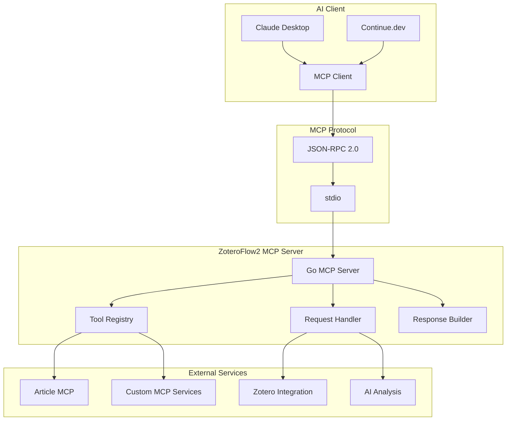
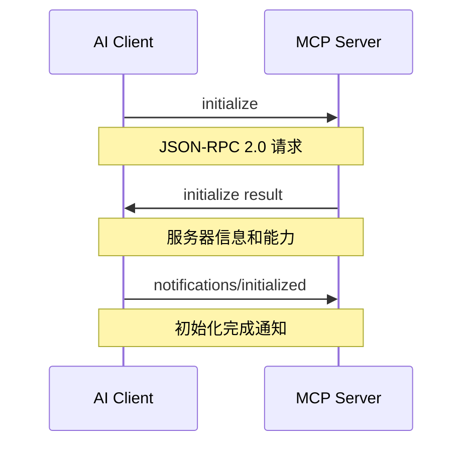
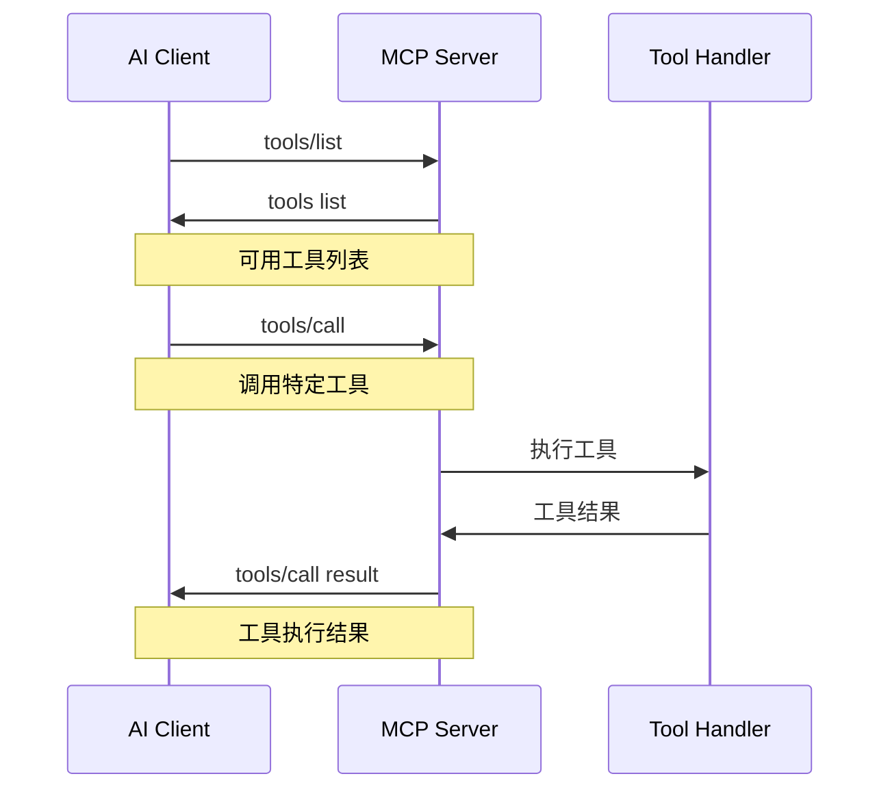

# MCP 集成概述

## 什么是 MCP

MCP (Model Context Protocol) 是一个标准化协议，用于在 AI 模型与外部工具和服务之间建立通信桥梁。它定义了一套统一的接口规范，使 AI 助手能够安全、可靠地调用外部 API 和服务。

## MCP 协议版本

- **当前版本**: MCP v2024-11-05
- **协议类型**: JSON-RPC 2.0 over stdio
- **传输方式**: 标准输入/输出流
- **数据格式**: JSON

## ZoteroFlow2 中的 MCP 集成

### 架构设计



### 支持的 MCP 服务

1. **Article MCP** ✅ 已集成
   - Europe PMC 文献搜索
   - arXiv 预印本搜索
   - 文献质量评估
   - 引用分析

2. **自定义 MCP 服务** 🔄 开发中
   - Zotero 文献管理
   - PDF 解析服务
   - AI 分析服务

## MCP 通信流程

### 初始化握手



### 工具调用流程



## MCP 数据结构

### 初始化请求

```json
{
    "jsonrpc": "2.0",
    "id": 1,
    "method": "initialize",
    "params": {
        "protocolVersion": "2024-11-05",
        "capabilities": {
            "experimental": {},
            "sampling": {}
        },
        "clientInfo": {
            "name": "claude-desktop",
            "version": "1.0.0"
        }
    }
}
```

### 初始化响应

```json
{
    "jsonrpc": "2.0",
    "id": 1,
    "result": {
        "protocolVersion": "2024-11-05",
        "capabilities": {
            "tools": {
                "listChanged": true
            }
        },
        "serverInfo": {
            "name": "zoteroflow2-mcp",
            "version": "1.0.0"
        }
    }
}
```

### 工具列表

```json
{
    "jsonrpc": "2.0",
    "id": 2,
    "result": {
        "tools": [
            {
                "name": "search_europe_pmc",
                "description": "搜索 Europe PMC 数据库中的文献",
                "inputSchema": {
                    "type": "object",
                    "properties": {
                        "keyword": {
                            "type": "string",
                            "description": "搜索关键词"
                        },
                        "max_results": {
                            "type": "integer",
                            "description": "最大结果数量",
                            "default": 10
                        }
                    },
                    "required": ["keyword"]
                }
            }
        ]
    }
}
```

### 工具调用

```json
{
    "jsonrpc": "2.0",
    "id": 3,
    "method": "tools/call",
    "params": {
        "name": "search_europe_pmc",
        "arguments": {
            "keyword": "machine learning",
            "max_results": 5
        }
    }
}
```

### 工具调用响应

```json
{
    "jsonrpc": "2.0",
    "id": 3,
    "result": {
        "content": [
            {
                "type": "text",
                "text": "找到 5 篇相关文献..."
            }
        ]
    }
}
```

## ZoteroFlow2 MCP 实现

### MCP 客户端

```go
type MCPClient struct {
    cmd         *exec.Cmd
    stdin       io.WriteCloser
    stdout      *bufio.Scanner
    stderr      *bufio.Scanner
    requestID   int
    responses   map[int]chan *MCPResponse
    responseMu  sync.Mutex
    running     bool
    runningMu   sync.Mutex
}
```

### 核心功能

1. **连接管理**
   - 启动/停止 MCP 服务器进程
   - 建立 stdio 通信通道
   - 处理连接异常和重连

2. **消息处理**
   - JSON-RPC 2.0 消息序列化/反序列化
   - 请求/响应匹配
   - 异步消息处理

3. **工具调用**
   - 工具发现和列表
   - 工具参数验证
   - 结果解析和格式化

4. **错误处理**
   - 协议错误处理
   - 网络异常处理
   - 超时和重试机制

### 已验证的 MCP 服务

#### Article MCP 集成

```go
// Article MCP 工具调用示例
func callArticleMCP(client *MCPClient) error {
    // 初始化连接
    serverInfo, err := client.Initialize("zoteroflow-test", "1.0.0")
    if err != nil {
        return fmt.Errorf("初始化失败: %w", err)
    }
    
    fmt.Printf("连接成功: %s v%s\n", serverInfo.ServerInfo.Name, serverInfo.ServerInfo.Version)
    
    // 获取工具列表
    tools, err := client.ListTools()
    if err != nil {
        return fmt.Errorf("获取工具列表失败: %w", err)
    }
    
    fmt.Printf("发现 %d 个工具\n", len(tools.Tools))
    
    // 调用搜索工具
    result, err := client.CallTool("search_europe_pmc", map[string]interface{}{
        "keyword":     "machine learning",
        "max_results": 5,
    })
    if err != nil {
        return fmt.Errorf("工具调用失败: %w", err)
    }
    
    // 处理结果
    for _, content := range result.Content {
        if content.Type == "text" {
            fmt.Printf("搜索结果: %s\n", content.Text)
        }
    }
    
    return nil
}
```

## MCP 配置

### 环境变量

```bash
# MCP 服务配置
MCP_ARTICLE_COMMAND="uv tool run article-mcp server"
MCP_ARTICLE_TIMEOUT=30s

# MCP 协议配置
MCP_PROTOCOL_VERSION=2024-11-05
MCP_JSONRPC_VERSION=2.0

# 连接配置
MCP_CONNECTION_TIMEOUT=10s
MCP_REQUEST_TIMEOUT=60s
MCP_MAX_RETRIES=3
```

### 配置文件

```toml
# ~/.zoteroflow/mcp.toml

[mcp]
protocol_version = "2024-11-05"
connection_timeout = "10s"
request_timeout = "60s"
max_retries = 3

[mcp.services]
[mcp.services.article_mcp]
enabled = true
command = "uv"
args = ["tool", "run", "article-mcp", "server"]
timeout = "30s"

[mcp.services.custom_mcp]
enabled = false
command = "./custom-mcp-server"
args = []
timeout = "30s"
```

## 使用示例

### 基础 MCP 连接

```go
package main

import (
    "fmt"
    "log"
    "zoteroflow2-server/mcp"
)

func main() {
    // 创建 MCP 客户端
    client := mcp.NewMCPClient([]string{
        "uv", "tool", "run", "article-mcp", "server",
    })
    
    // 启动服务器
    if err := client.Start(); err != nil {
        log.Fatalf("启动 MCP 服务器失败: %v", err)
    }
    defer client.Stop()
    
    // 初始化连接
    serverInfo, err := client.Initialize("zoteroflow-test", "1.0.0")
    if err != nil {
        log.Fatalf("初始化失败: %v", err)
    }
    
    fmt.Printf("MCP 连接成功: %s v%s\n", 
        serverInfo.ServerInfo.Name, 
        serverInfo.ServerInfo.Version)
    
    // 获取工具列表
    tools, err := client.ListTools()
    if err != nil {
        log.Printf("获取工具列表失败: %v", err)
        return
    }
    
    fmt.Printf("可用工具:\n")
    for i, tool := range tools.Tools {
        fmt.Printf("  %d. %s - %s\n", i+1, tool.Name, tool.Description)
    }
}
```

### 智能文献搜索

```go
func intelligentLiteratureSearch(client *mcp.MCPClient, query string) error {
    fmt.Printf("🔍 开始智能文献搜索: %s\n", query)
    
    // 1. 搜索 Europe PMC
    fmt.Println("\n📚 步骤1: 搜索 Europe PMC 数据库")
    europeResult, err := client.CallTool("search_europe_pmc", map[string]interface{}{
        "keyword":     query,
        "max_results":  10,
    })
    if err != nil {
        fmt.Printf("❌ Europe PMC 搜索失败: %v\n", err)
    } else {
        fmt.Printf("✅ Europe PMC 搜索成功\n")
        displayResult(europeResult)
    }
    
    // 2. 搜索 arXiv
    fmt.Println("\n📖 步骤2: 搜索 arXiv 数据库")
    arxivResult, err := client.CallTool("search_arxiv_papers", map[string]interface{}{
        "keyword":     query,
        "max_results":  5,
    })
    if err != nil {
        fmt.Printf("❌ arXiv 搜索失败: %v\n", err)
    } else {
        fmt.Printf("✅ arXiv 搜索成功\n")
        displayResult(arxivResult)
    }
    
    return nil
}

func displayResult(result *mcp.CallToolResult) {
    for _, content := range result.Content {
        if content.Type == "text" {
            text := content.Text
            if len(text) > 200 {
                text = text[:200] + "..."
            }
            fmt.Printf("📄 %s\n", text)
        }
    }
}
```

### 文献质量评估

```go
func evaluateArticleQuality(client *mcp.MCPClient, articleID string) error {
    fmt.Printf("📊 开始文献质量评估: %s\n", articleID)
    
    // 1. 获取文章详情
    fmt.Println("\n📄 步骤1: 获取文章详细信息")
    detailResult, err := client.CallTool("get_article_details", map[string]interface{}{
        "identifier": articleID,
        "id_type":    "pmid",
    })
    if err != nil {
        return fmt.Errorf("获取文章详情失败: %w", err)
    }
    
    fmt.Printf("✅ 文章详情获取成功\n")
    displayResult(detailResult)
    
    // 2. 获取引用文献
    fmt.Println("\n🔗 步骤2: 获取引用文献")
    citingResult, err := client.CallTool("get_citing_articles", map[string]interface{}{
        "identifier":   articleID,
        "id_type":      "pmid",
        "max_results":  10,
    })
    if err != nil {
        fmt.Printf("❌ 获取引用文献失败: %v\n", err)
    } else {
        fmt.Printf("✅ 引用文献获取成功\n")
        displayResult(citingResult)
    }
    
    return nil
}
```

## 错误处理

### 常见 MCP 错误

1. **连接错误**
   ```go
   if strings.Contains(err.Error(), "connection") {
       // MCP 服务器连接失败
   }
   ```

2. **协议错误**
   ```go
   if strings.Contains(err.Error(), "jsonrpc") {
       // JSON-RPC 协议错误
   }
   ```

3. **工具错误**
   ```go
   if strings.Contains(err.Error(), "tool") {
       // 工具调用错误
   }
   ```

4. **超时错误**
   ```go
   if strings.Contains(err.Error(), "timeout") {
       // 请求超时
   }
   ```

### 错误处理示例

```go
func safeMCPCall(client *mcp.MCPClient, toolName string, args map[string]interface{}) (*mcp.CallToolResult, error) {
    result, err := client.CallTool(toolName, args)
    if err != nil {
        switch {
        case strings.Contains(err.Error(), "connection"):
            return nil, fmt.Errorf("MCP连接失败，请检查服务器状态")
        case strings.Contains(err.Error(), "timeout"):
            return nil, fmt.Errorf("请求超时，请稍后重试")
        case strings.Contains(err.Error(), "tool not found"):
            return nil, fmt.Errorf("工具不存在: %s", toolName)
        case strings.Contains(err.Error(), "invalid arguments"):
            return nil, fmt.Errorf("参数无效: %v", args)
        default:
            return nil, fmt.Errorf("MCP调用失败: %w", err)
        }
    }
    
    return result, nil
}
```

## 性能优化

### 连接池

```go
type MCPClientPool struct {
    clients chan *mcp.MCPClient
    factory  func() *mcp.MCPClient
    maxSize  int
}

func NewMCPClientPool(maxSize int, factory func() *mcp.MCPClient) *MCPClientPool {
    pool := &MCPClientPool{
        clients: make(chan *mcp.MCPClient, maxSize),
        factory: factory,
        maxSize: maxSize,
    }
    
    // 预创建客户端
    for i := 0; i < maxSize; i++ {
        client := factory()
        if err := client.Start(); err == nil {
            pool.clients <- client
        }
    }
    
    return pool
}

func (p *MCPClientPool) Get() *mcp.MCPClient {
    select {
    case client := <-p.clients:
        return client
    default:
        // 池为空，创建新客户端
        client := p.factory()
        client.Start()
        return client
    }
}

func (p *MCPClientPool) Put(client *mcp.MCPClient) {
    select {
    case p.clients <- client:
        // 归还到池中
    default:
        // 池满，直接关闭
        client.Stop()
    }
}
```

### 请求缓存

```go
type CachedMCPClient struct {
    *mcp.MCPClient
    cache map[string]*CacheEntry
    mutex sync.RWMutex
    ttl   time.Duration
}

type CacheEntry struct {
    Result  *mcp.CallToolResult
    Created time.Time
    TTL     time.Duration
}

func (c *CachedMCPClient) CallTool(toolName string, args map[string]interface{}) (*mcp.CallToolResult, error) {
    // 生成缓存键
    cacheKey := c.generateCacheKey(toolName, args)
    
    // 检查缓存
    c.mutex.RLock()
    if entry, exists := c.cache[cacheKey]; exists {
        if time.Since(entry.Created) < entry.TTL {
            c.mutex.RUnlock()
            return entry.Result, nil
        }
    }
    c.mutex.RUnlock()
    
    // 调用原始方法
    result, err := c.MCPClient.CallTool(toolName, args)
    if err != nil {
        return nil, err
    }
    
    // 缓存结果
    c.mutex.Lock()
    c.cache[cacheKey] = &CacheEntry{
        Result:  result,
        Created: time.Now(),
        TTL:     c.ttl,
    }
    c.mutex.Unlock()
    
    return result, nil
}
```

## 监控和日志

### MCP 连接监控

```go
type MCPMonitor struct {
    client *mcp.MCPClient
    stats  *MCPStats
    mutex  sync.RWMutex
}

type MCPStats struct {
    TotalRequests    int64         `json:"total_requests"`
    SuccessfulCalls  int64         `json:"successful_calls"`
    FailedCalls      int64         `json:"failed_calls"`
    AverageLatency   time.Duration `json:"average_latency"`
    TotalLatency     time.Duration `json:"total_latency"`
    LastRequestTime  time.Time     `json:"last_request_time"`
}

func (m *MCPMonitor) RecordCall(success bool, latency time.Duration) {
    m.mutex.Lock()
    defer m.mutex.Unlock()
    
    m.stats.TotalRequests++
    m.stats.LastRequestTime = time.Now()
    m.stats.TotalLatency += latency
    
    if success {
        m.stats.SuccessfulCalls++
    } else {
        m.stats.FailedCalls++
    }
    
    m.stats.AverageLatency = m.stats.TotalLatency / time.Duration(m.stats.TotalRequests)
}

func (m *MCPMonitor) GetStats() *MCPStats {
    m.mutex.RLock()
    defer m.mutex.RUnlock()
    
    // 返回统计信息的副本
    return &MCPStats{
        TotalRequests:   m.stats.TotalRequests,
        SuccessfulCalls: m.stats.SuccessfulCalls,
        FailedCalls:     m.stats.FailedCalls,
        AverageLatency:  m.stats.AverageLatency,
        TotalLatency:   m.stats.TotalLatency,
        LastRequestTime: m.stats.LastRequestTime,
    }
}
```

## 最佳实践

### 1. 连接管理
- 使用连接池提高性能
- 及时释放不需要的连接
- 实现自动重连机制

### 2. 错误处理
- 区分不同类型的错误
- 实现重试机制
- 提供用户友好的错误信息

### 3. 性能优化
- 使用缓存减少重复调用
- 合理设置超时时间
- 监控连接状态和性能指标

### 4. 安全考虑
- 验证输入参数
- 限制请求频率
- 记录访问日志

## 版本兼容性

- **MCP v2024-11-05**: 完全支持
- **JSON-RPC 2.0**: 完全支持
- **Article MCP**: 完全支持
- **Go 1.21+**: 支持

## 注意事项

1. **进程管理**: MCP 服务器作为独立进程运行，需要正确管理进程生命周期
2. **通信稳定性**: stdio 通信可能受到进程间通信影响，需要错误处理
3. **资源限制**: 注意并发连接数和内存使用
4. **协议兼容性**: 确保客户端和服务器使用相同的 MCP 协议版本
5. **超时设置**: 合理设置各种超时参数，避免长时间阻塞

## 未来扩展

### 计划中的 MCP 服务

1. **Zotero MCP**
   - 文献搜索和管理
   - 元数据提取
   - 标签管理

2. **PDF 解析 MCP**
   - MinerU 集成
   - 文档结构化
   - 内容提取

3. **AI 分析 MCP**
   - 文献分析
   - 智能摘要
   - 质量评估

4. **自定义 MCP**
   - 用户定义工具
   - 第三方服务集成
   - 工作流自动化